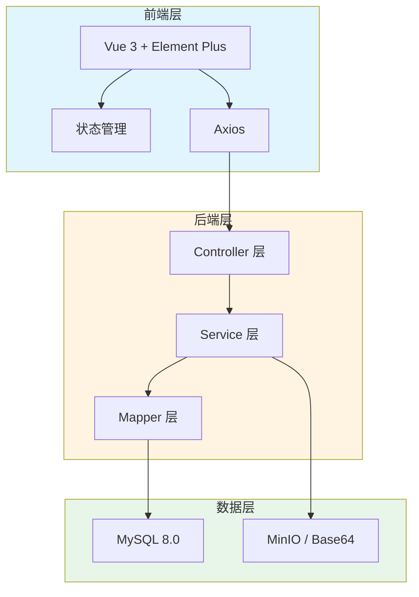
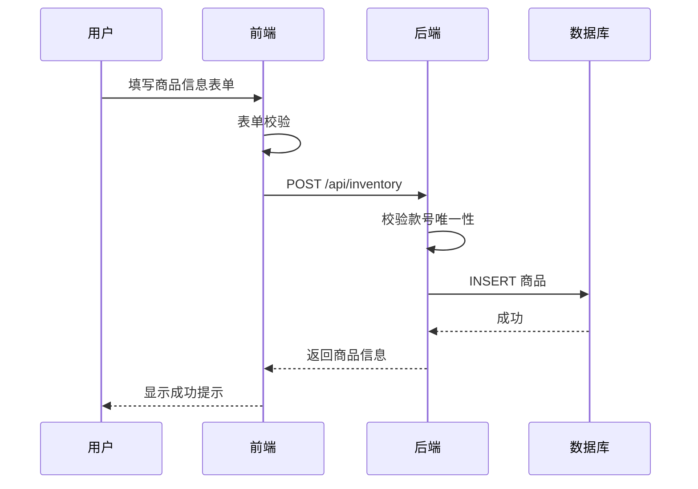
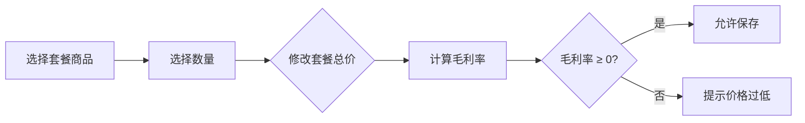

# 架构设计

## 系统概述

库存管理系统采用前后端分离架构，前端负责页面展示和用户交互，后端提供 API 服务和数据处理能力。

## 技术栈

### 前端
- Vue 3.4+ (组合式 API)
- Element Plus 2.4+
- Axios 1.6+
- Vite 5.0+ (构建工具)

### 后端
- Spring Boot 2.7.18
- MyBatis-Plus 3.5+
- MySQL 8.0
- MinIO (可选)

## 项目结构

```
inventory-management/
├── frontend/                    # 前端项目
│   ├── src/
│   │   ├── api/               # API 接口封装
│   │   ├── components/       # 公共组件
│   │   ├── views/            # 页面视图
│   │   │   ├── inventory/    # 库存模块
│   │   │   └── package/      # 套餐模块
│   │   ├── router/           # 路由配置
│   │   ├── stores/           # 状态管理
│   │   ├── utils/            # 工具函数
│   │   └── App.vue
│   └── package.json
│
├── backend/                    # 后端项目
│   ├── src/
│   │   └── main/
│   │       ├── java/
│   │       │   └── com/inventory/
│   │       │       ├── controller/    # 控制层
│   │       │       ├── service/       # 业务层
│   │       │       ├── mapper/        # 数据访问层
│   │       │       ├── entity/        # 实体类
│   │       │       ├── dto/           # 数据传输对象
│   │       │       └── config/        # 配置类
│   │       └── resources/
│   │           └── application.yml
│   └── pom.xml
```

## 核心模块/组件

### 前端模块

| 模块 | 职责 | 主要组件 |
|------|------|----------|
| 库存管理 | 商品信息的增删改查 | InventoryList, InventoryForm, ImportDialog |
| 套餐管理 | 套餐组合和毛利率计算 | PackageList, PackageForm, PackageDetail |
| 图片管理 | 图片上传和预览 | ImageUpload, ImagePreview |

### 后端模块

| 模块 | 职责 | 主要类 |
|------|------|--------|
| InventoryService | 库存商品业务逻辑 | InventoryServiceImpl |
| PackageService | 套餐组合业务逻辑 | PackageServiceImpl |
| ExcelService | Excel 导入导出 | ExcelImportService |
| ImageService | 图片存储服务 | ImageServiceImpl |

## 架构图



## 关键流程

### 库存商品录入流程



### 套餐毛利率计算流程



## 设计决策

### 1. 图片存储方案

| 方案 | 适用场景 | 优点 | 缺点 |
|------|---------|------|------|
| Base64 | 开发环境、小规模使用 | 无额外依赖 | 数据库体积增加约 33% |
| MinIO | 生产环境、大规模使用 | 支持 CDN、弹性扩展 | 需要独立部署 |

**决策**: 开发环境使用 Base64，生产环境推荐 MinIO。

### 2. Excel 导入限制

- 单次导入上限 1000 条，避免内存溢出
- 使用进度条显示导入进度
- 导入失败时返回错误明细，支持部分成功

### 3. 款号唯一性

- 款号作为商品唯一标识
- 新增时自动校验，导入时批量校验
- 不允许修改已有商品的款号

## 数据库设计

### 商品表 (inventory)

| 字段 | 类型 | 说明 |
|------|------|------|
| id | BIGINT | 主键 |
| style_no | VARCHAR(50) | 款号（唯一） |
| name | VARCHAR(100) | 品名 |
| image | TEXT | 图片 Base64/MinIO URL |
| size_mm | VARCHAR(50) | 产品尺寸 |
| weight_kg | DECIMAL(10,3) | 参考裸重 |
| box_spec | INT | 箱规 |
| price_excl_tax | DECIMAL(10,2) | 不含税拿货价 |
| guide_price | DECIMAL(10,2) | 市场指导价 |
| min_price | DECIMAL(10,2) | 市场最低控价 |
| quantity | INT | 数量 |
| create_time | DATETIME | 创建时间 |
| update_time | DATETIME | 更新时间 |

### 套餐表 (package)

| 字段 | 类型 | 说明 |
|------|------|------|
| id | BIGINT | 主键 |
| name | VARCHAR(100) | 套餐名称 |
| total_price | DECIMAL(10,2) | 套餐总价 |
| cost_price | DECIMAL(10,2) | 成本总价 |
| profit_rate | DECIMAL(5,2) | 毛利率 |
| create_time | DATETIME | 创建时间 |
| update_time | DATETIME | 更新时间 |

### 套餐明细表 (package_item)

| 字段 | 类型 | 说明 |
|------|------|------|
| id | BIGINT | 主键 |
| package_id | BIGINT | 套餐 ID |
| inventory_id | BIGINT | 商品 ID |
| quantity | INT | 数量 |
