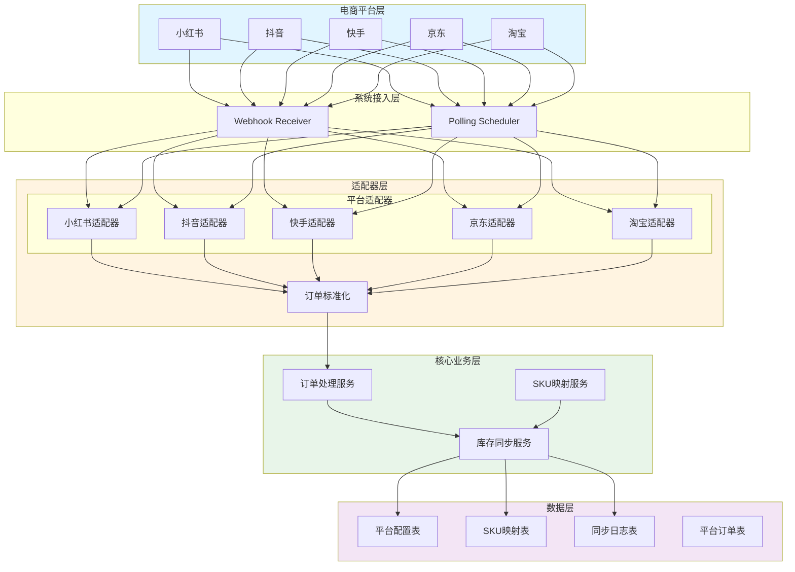
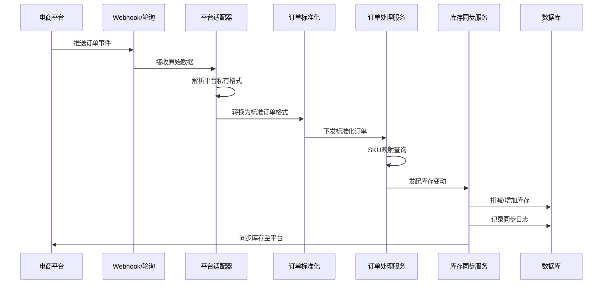
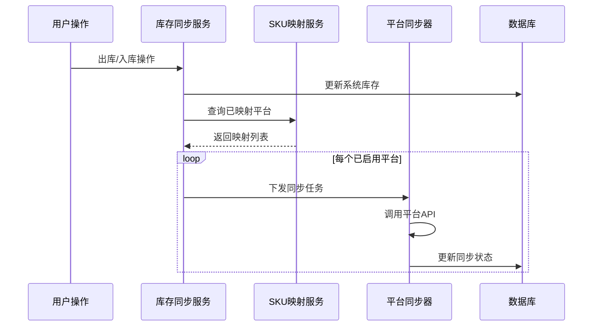

# 技术设计文档 - 电商平台库存对接

## 基本信息

- **功能名称**: ecommerce-platform-integration
- **更新日期**: 2026-04-12
- **状态**: 待实现

## 1. 描述

实现库存管理系统与小红书、抖音、快手、京东、淘宝五大主流电商平台的库存同步与自动化出入库管理。采用平台适配器模式统一处理各平台API差异，支持Webhook和轮询两种订单事件接收方式。

## 2. 架构设计

### 2.1 整体架构



### 2.2 核心流程

#### 2.2.1 订单处理流程



#### 2.2.2 库存同步时序



## 3. 组件与接口设计

### 3.1 平台适配器接口

```java
public interface PlatformAdapter {
    /**
     * 获取平台标识
     */
    PlatformType getPlatformType();
    
    /**
     * 验证API凭证
     */
    boolean verifyCredentials(PlatformCredential credential);
    
    /**
     * 刷新Token
     */
    String refreshToken(String refreshToken);
    
    /**
     * 解析Webhook请求
     */
    StandardOrder parseWebhookRequest(HttpServletRequest request);
    
    /**
     * 获取订单列表（轮询用）
     */
    List<StandardOrder> fetchOrders(Date since);
    
    /**
     * 同步库存到平台
     */
    boolean syncInventory(String platformSku, Integer quantity);
    
    /**
     * 生成平台专用签名
     */
    String generateSignature(Map<String, String> params, String secret);
}
```

### 3.2 标准化订单格式

```java
@Data
public class StandardOrder {
    private String orderId;              // 平台订单号
    private PlatformType platform;       // 平台来源
    private OrderType type;              // 订单类型：SALE/REFUND
    private String platformSku;          // 平台商品SKU
    private String systemSku;            // 系统商品SKU（映射后）
    private Integer quantity;            // 商品数量
    private BigDecimal amount;           // 订单金额
    private OrderStatus status;          // 订单状态
    private Date paidTime;              // 支付时间
    private Date refundTime;            // 退款时间
    private String rawData;             // 原始JSON
}
```

### 3.3 核心服务接口

```java
public interface OrderProcessService {
    /**
     * 处理标准化订单
     */
    void processOrder(StandardOrder order);
}

public interface InventorySyncService {
    /**
     * 同步库存到所有已映射平台
     */
    void syncToAllPlatforms(Long inventoryId, Integer newQuantity);
    
    /**
     * 同步库存到指定平台
     */
    SyncResult syncToPlatform(SkuMapping mapping, Integer quantity);
    
    /**
     * 批量同步
     */
    void batchSync(List<Long> inventoryIds);
}

public interface SkuMappingService {
    /**
     * 创建SKU映射
     */
    SkuMapping createMapping(Long inventoryId, PlatformType platform, String platformSku);
    
    /**
     * 根据平台SKU查询系统SKU
     */
    SkuMapping getByPlatformSku(PlatformType platform, String platformSku);
    
    /**
     * 根据系统SKU查询所有映射
     */
    List<SkuMapping> getByInventoryId(Long inventoryId);
}
```

## 4. 数据模型

### 4.1 数据库表设计

#### 4.1.1 平台配置表 (platform_config)

| 字段 | 类型 | 说明 |
|------|------|------|
| id | BIGINT | 主键 |
| platform | VARCHAR(20) | 平台标识（XIAOHONGSHU/DOUYIN/KUAISHOU/JD/TAOBAO） |
| shop_name | VARCHAR(100) | 店铺名称 |
| app_key | VARCHAR(255) | API AppKey（加密存储） |
| app_secret | VARCHAR(255) | API AppSecret（加密存储） |
| access_token | VARCHAR(255) | Access Token（加密存储） |
| refresh_token | VARCHAR(255) | Refresh Token（加密存储） |
| token_expire_time | DATETIME | Token过期时间 |
| webhook_url | VARCHAR(255) | Webhook回调地址 |
| enabled | TINYINT | 是否启用（0禁用/1启用） |
| sync_mode | VARCHAR(20) | 同步模式（IMMEDIATE/SCHEDULED） |
| sync_interval | INT | 同步周期（分钟） |
| last_sync_time | DATETIME | 最后同步时间 |
| last_heartbeat | DATETIME | 最后心跳时间 |
| status | VARCHAR(20) | 连接状态（CONNECTED/DISCONNECTED/ERROR） |
| create_time | DATETIME | 创建时间 |
| update_time | DATETIME | 更新时间 |

#### 4.1.2 SKU映射表 (sku_mapping)

| 字段 | 类型 | 说明 |
|------|------|------|
| id | BIGINT | 主键 |
| inventory_id | BIGINT | 系统商品ID |
| platform | VARCHAR(20) | 平台标识 |
| platform_sku | VARCHAR(100) | 平台商品SKU |
| platform_product_id | VARCHAR(100) | 平台商品ID |
| last_sync_quantity | INT | 最后同步数量 |
| last_sync_time | DATETIME | 最后同步时间 |
| create_time | DATETIME | 创建时间 |
| update_time | DATETIME | 更新时间 |
| UNIQUE | (platform, platform_sku) | 唯一索引 |
| INDEX | (inventory_id) | 系统商品索引 |

#### 4.1.3 同步日志表 (sync_log)

| 字段 | 类型 | 说明 |
|------|------|------|
| id | BIGINT | 主键 |
| platform | VARCHAR(20) | 平台标识 |
| order_id | VARCHAR(100) | 平台订单号 |
| inventory_id | BIGINT | 系统商品ID |
| platform_sku | VARCHAR(100) | 平台SKU |
| operation_type | VARCHAR(20) | 操作类型（SALE_OUT/REFUND_IN） |
| quantity_change | INT | 变动数量（正数入库/负数出库） |
| quantity_before | INT | 变动前库存 |
| quantity_after | INT | 变动后库存 |
| api_request_id | VARCHAR(100) | API请求ID |
| sync_status | VARCHAR(20) | 同步状态（SUCCESS/FAILED/PENDING） |
| error_message | TEXT | 错误信息 |
| raw_request | TEXT | 原始请求数据 |
| create_time | DATETIME | 创建时间 |

#### 4.1.4 平台订单表 (platform_order)

| 字段 | 类型 | 说明 |
|------|------|------|
| id | BIGINT | 主键 |
| platform | VARCHAR(20) | 平台标识 |
| order_id | VARCHAR(100) | 平台订单号（唯一） |
| sku_mapping_id | BIGINT | SKU映射ID |
| order_type | VARCHAR(20) | 订单类型 |
| quantity | INT | 商品数量 |
| amount | DECIMAL(15,2) | 订单金额 |
| status | VARCHAR(20) | 订单状态 |
| paid_time | DATETIME | 支付时间 |
| refund_time | DATETIME | 退款时间 |
| processed | TINYINT | 是否已处理（0未处理/1已处理） |
| raw_data | TEXT | 原始JSON |
| create_time | DATETIME | 创建时间 |
| update_time | DATETIME | 更新时间 |
| UNIQUE | (platform, order_id) | 唯一索引 |

### 4.2 枚举定义

```java
public enum PlatformType {
    XIAOHONGSHU("小红书"),
    DOUYIN("抖音"),
    KUAISHOU("快手"),
    JD("京东"),
    TAOBAO("淘宝");
}

public enum OrderType {
    SALE("销售订单"),
    REFUND("退货订单");
}

public enum OrderStatus {
    PENDING("待处理"),
    PAID("已支付"),
    SHIPPED("已发货"),
    COMPLETED("已完成"),
    REFUNDING("退款中"),
    REFUNDED("已退款");
}

public enum SyncMode {
    IMMEDIATE("即时同步"),
    SCHEDULED("定时同步");
}

public enum SyncStatus {
    SUCCESS("成功"),
    FAILED("失败"),
    PENDING("处理中"),
    RETRYING("重试中");
}
```

## 5. 关键设计决策

### 5.1 平台适配器模式

**决策**: 采用适配器模式封装各平台API差异
**理由**: 
- 各平台API协议、数据格式、签名方式完全不同
- 适配器模式可将平台差异隔离在独立模块中
- 新增平台只需实现适配器接口，不影响核心业务
- 便于单元测试和Mock

### 5.2 双重订单接收机制

**决策**: Webhook优先，轮询作为兜底
**理由**:
- Webhook实时性高，减少订单延迟
- 轮询作为补偿策略，防止Webhook失败漏单
- 可通过配置控制是否启用轮询

### 5.3 同步重试机制

**决策**: 失败时按指数退避策略重试3次
**理由**:
- 网络波动导致的临时失败可通过重试恢复
- 指数退避避免对平台API造成压力
- 3次重试后可判定为实质性错误，需要人工介入

### 5.4 凭证安全存储

**决策**: 敏感凭证加密存储，使用时解密
**理由**:
- 数据库泄露不会直接暴露凭证
- 可使用AES或数据库内置加密功能

## 6. 错误处理

### 6.1 错误场景

| 场景 | 处理策略 |
|------|----------|
| Webhook签名验证失败 | 记录日志，返回400，忽略请求 |
| API凭证无效/过期 | 禁用平台同步，发送告警 |
| SKU未映射 | 记录异常订单，发送告警，等待人工处理 |
| 库存不足 | 记录异常订单，扣减失败，发送告警 |
| 平台API调用失败 | 重试3次，记录日志 |
| 同步超时 | 重试，标记失败 |

### 6.2 告警规则

| 告警类型 | 触发条件 | 通知方式 |
|----------|----------|----------|
| 连接失败 | 连续3次心跳失败 | 邮件+站内消息 |
| 凭证过期 | Token过期前7天 | 站内消息 |
| 库存异常 | 库存为负数 | 邮件+站内消息 |
| 同步失败 | 3次重试后仍失败 | 邮件+站内消息 |

## 7. 项目结构

```
backend/src/main/java/com/inventory/
├── controller/
│   └── PlatformConfigController.java      # 平台配置管理
├── service/
│   ├── PlatformConfigService.java
│   ├── OrderProcessService.java          # 订单处理
│   ├── InventorySyncService.java         # 库存同步
│   └── SkuMappingService.java             # SKU映射
├── adapter/
│   ├── PlatformAdapter.java              # 适配器接口
│   ├── XiaohongshuAdapter.java           # 小红书适配器
│   ├── DouyinAdapter.java                # 抖音适配器
│   ├── KuaishouAdapter.java             # 快手适配器
│   ├── JdAdapter.java                    # 京东适配器
│   └── TaobaoAdapter.java                # 淘宝适配器
├── entity/
│   ├── PlatformConfig.java
│   ├── SkuMapping.java
│   ├── SyncLog.java
│   └── PlatformOrder.java
├── dto/
│   ├── StandardOrder.java
│   ├── PlatformCredential.java
│   └── SyncResult.java
├── scheduler/
│   └── PlatformPollingScheduler.java     # 轮询调度器
├── config/
│   └── WebhookConfig.java                 # Webhook路由配置
└── util/
    └── CryptoUtil.java                    # 加密工具类

frontend/src/views/
├── platform/
│   ├── ConfigList.vue                    # 平台配置列表
│   ├── ConfigForm.vue                    # 平台配置表单
│   └── TestConnection.vue                # 测试连接组件
├── sku-mapping/
│   └── MappingList.vue                   # SKU映射管理
├── sync-log/
│   └── LogList.vue                       # 同步日志查询
└── monitor/
    └── Dashboard.vue                     # 监控面板
```

## 8. 测试策略

### 8.1 单元测试

- 平台适配器：Mock各平台API响应，验证解析和转换逻辑
- SKU映射服务：测试各种映射场景
- 库存同步服务：Mock平台API，验证同步逻辑

### 8.2 集成测试

- Webhook接口：使用各平台Mock服务器推送测试事件
- 轮询调度：Mock平台API返回测试数据
- 端到端：创建测试订单，验证完整流程

### 8.3 性能测试

- 单平台1000订单/秒处理能力
- 5平台并发同步场景
