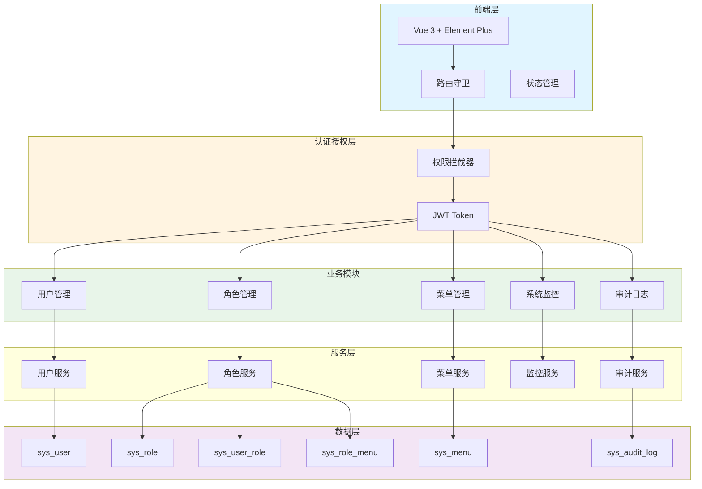
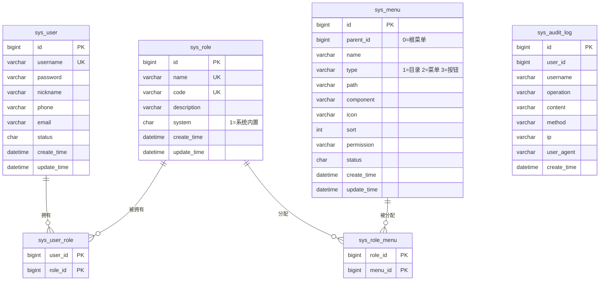

# 技术设计文档 - 系统管理模块

## 基本信息

- **功能名称**: system-management
- **更新日期**: 2026-04-12
- **状态**: 待实现

## 1. 描述

系统管理模块包含用户管理、角色权限管理（RBAC）、菜单管理、系统监控和审计日志功能。采用RBAC模型实现细粒度的权限控制，支持动态权限分配和实时系统监控。

## 2. 架构设计

### 2.1 整体架构



### 2.2 数据模型



## 3. 数据库表设计

### 3.1 角色表 (sys_role)

| 字段 | 类型 | 说明 |
|------|------|------|
| id | BIGINT | 主键 |
| name | VARCHAR(50) | 角色名称 |
| code | VARCHAR(50) | 角色编码（唯一） |
| description | VARCHAR(255) | 描述 |
| is_system | TINYINT | 是否系统内置（1=是） |
| create_time | DATETIME | 创建时间 |
| update_time | DATETIME | 更新时间 |

### 3.2 用户角色关联表 (sys_user_role)

| 字段 | 类型 | 说明 |
|------|------|------|
| user_id | BIGINT | 用户ID |
| role_id | BIGINT | 角色ID |
| PRIMARY KEY | (user_id, role_id) | 联合主键 |

### 3.3 菜单表 (sys_menu)

| 字段 | 类型 | 说明 |
|------|------|------|
| id | BIGINT | 主键 |
| parent_id | BIGINT | 父菜单ID（0=根） |
| name | VARCHAR(50) | 菜单名称 |
| type | CHAR | 类型（1=目录 2=菜单 3=按钮） |
| path | VARCHAR(255) | 路由路径 |
| component | VARCHAR(255) | 组件路径 |
| icon | VARCHAR(50) | 图标 |
| sort | INT | 排序 |
| permission | VARCHAR(100) | 权限标识 |
| status | CHAR | 状态（0=禁用 1=启用） |
| create_time | DATETIME | 创建时间 |
| update_time | DATETIME | 更新时间 |

### 3.4 角色菜单关联表 (sys_role_menu)

| 字段 | 类型 | 说明 |
|------|------|------|
| role_id | BIGINT | 角色ID |
| menu_id | BIGINT | 菜单ID |
| PRIMARY KEY | (role_id, menu_id) | 联合主键 |

### 3.5 审计日志表 (sys_audit_log)

| 字段 | 类型 | 说明 |
|------|------|------|
| id | BIGINT | 主键 |
| user_id | BIGINT | 用户ID |
| username | VARCHAR(50) | 用户名 |
| operation | VARCHAR(50) | 操作类型 |
| content | TEXT | 操作内容 |
| method | VARCHAR(200) | 请求方法 |
| ip | VARCHAR(50) | IP地址 |
| user_agent | VARCHAR(500) | 浏览器信息 |
| create_time | DATETIME | 操作时间 |

## 4. 组件与接口设计

### 4.1 核心服务接口

```java
public interface UserService {
    Page<User> page(UserQuery query);
    User getById(Long id);
    Long create(UserDTO dto);
    void update(Long id, UserDTO dto);
    void delete(Long id);
    void assignRoles(Long userId, List<Long> roleIds);
    void resetPassword(Long id);
}

public interface RoleService {
    List<Role> list();
    Page<Role> page(RoleQuery query);
    Role getById(Long id);
    Long create(RoleDTO dto);
    void update(Long id, RoleDTO dto);
    void delete(Long id);
    void assignMenus(Long roleId, List<Long> menuIds);
}

public interface MenuService {
    List<Menu> tree();
    List<Menu> listByRoleId(Long roleId);
    Menu getById(Long id);
    Long create(MenuDTO dto);
    void update(Long id, MenuDTO dto);
    void delete(Long id);
}

public interface AuditLogService {
    IPage<AuditLog> page(AuditLogQuery query);
    void log(String operation, String content, String method, String ip);
    void export(AuditLogQuery query);
}
```

### 4.2 权限验证注解

```java
@Target({ElementType.METHOD})
@Retention(RetentionPolicy.RUNTIME)
public @interface RequirePermission {
    String value();
}
```

### 4.3 监控指标接口

```java
public class SystemMetrics {
    private CpuMetrics cpu;
    private MemoryMetrics memory;
    private DiskMetrics disk;
    private JvmMetrics jvm;
    private TomcatMetrics tomcat;
    private DbMetrics db;
}

public class CpuMetrics {
    private double usagePercent;
    private int cores;
}

public class MemoryMetrics {
    private long total;
    private long used;
    private long free;
    private double usagePercent;
}
```

## 5. 项目结构

```
backend/src/main/java/com/inventory/
├── controller/
│   ├── UserController.java           # 用户管理
│   ├── RoleController.java           # 角色管理
│   ├── MenuController.java           # 菜单管理
│   ├── AuditLogController.java       # 审计日志
│   └── MonitorController.java         # 系统监控
├── service/
│   ├── UserService.java
│   ├── RoleService.java
│   ├── MenuService.java
│   ├── AuditLogService.java
│   └── MonitorService.java
├── entity/
│   ├── Role.java
│   ├── UserRole.java
│   ├── Menu.java
│   ├── RoleMenu.java
│   └── AuditLog.java
├── dto/
│   ├── UserDTO.java
│   ├── RoleDTO.java
│   ├── MenuDTO.java
│   └── SystemMetrics.java
├── mapper/
│   ├── RoleMapper.java
│   ├── UserRoleMapper.java
│   ├── MenuMapper.java
│   ├── RoleMenuMapper.java
│   └── AuditLogMapper.java
├── config/
│   ├── SecurityConfig.java           # 安全配置
│   └── WebMvcConfig.java             # Web配置
├── interceptor/
│   └── PermissionInterceptor.java     # 权限拦截器
├── annotation/
│   └── RequirePermission.java         # 权限注解
├── aspect/
│   └── AuditAspect.java              # 审计日志切面
└── util/
    └── MetricsUtil.java              # 监控指标工具

frontend/src/views/system/
├── user/
│   ├── UserList.vue                  # 用户列表
│   └── UserForm.vue                  # 用户表单
├── role/
│   ├── RoleList.vue                  # 角色列表
│   └── RoleForm.vue                  # 角色表单（权限分配）
├── menu/
│   └── MenuList.vue                  # 菜单管理
├── audit/
│   └── AuditLogList.vue              # 审计日志
└── monitor/
    └── SystemMonitor.vue             # 系统监控
```

## 6. 预定义数据

### 6.1 预定义角色

```sql
INSERT INTO sys_role (name, code, description, is_system) VALUES
('超级管理员', 'SUPER_ADMIN', '拥有系统所有权限', 1),
('系统管理员', 'ADMIN', '拥有除角色管理外的所有权限', 1),
('操作员', 'OPERATOR', '只能操作业务功能', 1),
('查看者', 'VIEWER', '只能查看数据', 1);
```

### 6.2 预定义菜单

```sql
INSERT INTO sys_menu (parent_id, name, type, path, component, icon, sort, permission, status) VALUES
(0, '系统管理', 1, '/system', null, 'el-icon-setting', 100, null, 1),
(1, '用户管理', 2, '/system/user', 'system/user/UserList', 'el-icon-user', 1, 'system:user:list', 1),
(1, '角色管理', 2, '/system/role', 'system/role/RoleList', 'el-icon-postcard', 2, 'system:role:list', 1),
(1, '菜单管理', 2, '/system/menu', 'system/menu/MenuList', 'el-icon-menu', 3, 'system:menu:list', 1),
(1, '审计日志', 2, '/system/audit', 'system/audit/AuditLogList', 'el-icon-document', 4, 'system:audit:list', 1),
(1, '系统监控', 2, '/system/monitor', 'system/monitor/SystemMonitor', 'el-icon-monitor', 5, 'system:monitor:view', 1);
```

## 7. 监控指标

| 指标类别 | 监控项 | 告警阈值 |
|----------|--------|----------|
| CPU | 使用率 | > 80% |
| 内存 | 使用率 | > 85% |
| 磁盘 | 使用率 | > 90% |
| 请求 | QPS | > 1000 |
| 响应时间 | 平均RT | > 500ms |
| 错误率 | 5xx比例 | > 5% |
| 数据库 | 连接数 | > 80% |
| JVM | 堆使用率 | > 85% |

## 8. 测试策略

### 8.1 单元测试

- 用户服务：用户CRUD、角色分配
- 角色服务：角色CRUD、权限分配
- 权限拦截：Token验证、权限校验

### 8.2 集成测试

- RBAC完整流程：用户登录 -> 获取权限 -> 访问接口
- 审计日志：操作触发 -> 记录保存 -> 查询导出

### 8.3 性能测试

- 100并发用户登录
- 1000次/秒权限验证
- 监控接口响应时间 < 200ms
